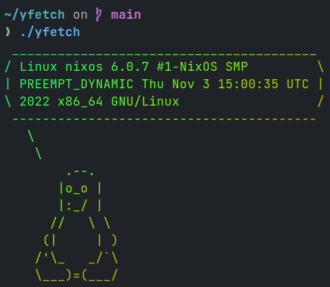

# yfetch



`yfetch` (pronounced why-fetch) is a minimal command-line tool for fetching and displaying system information.

It is written in POSIX shell and integrates with:

- [GNU Make](https://www.gnu.org/software/make)
- [just](https://just.systems)
- [npm](https://npmjs.com)
- [yarn](https://yarnpkg.com)
- [pnpm](https://pnpm.io)

## Usage

run one of the following commands

```sh
./yfetch
make
just
npm run all
yarn all
pnpm all
```

## Building

run one of the following commands

```sh
scripts/build
make build
just build
npm run build
yarn build
pnpm build
```

## Testing

run one of the following commands

```sh
make test
just test
npm test
yarn test
pnpm test
```

## Dependencies

- sh (bash, dash, e.t.c)
- either nix or cowsay and lolcat

## Why

not

## License

[WTFPL](LICENSE)
